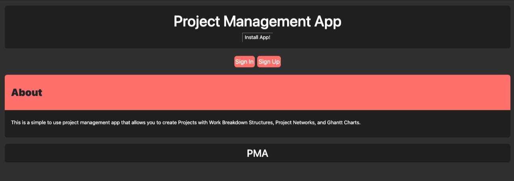
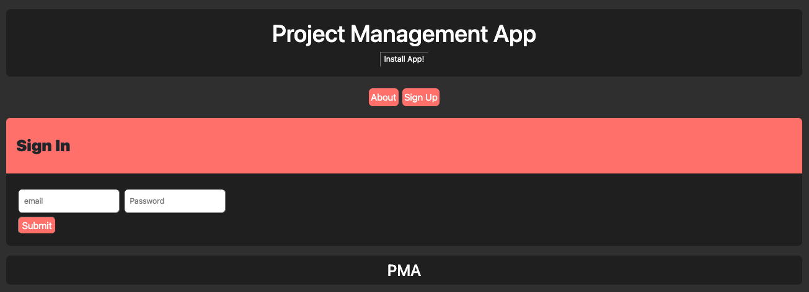
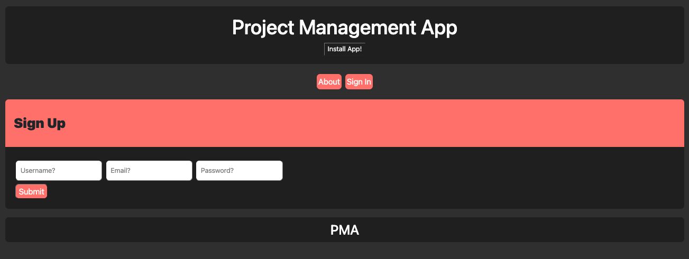

# 23 Final Project: MERN Stack Single-Page Application: Project Management App

## Table of Contents
- [Resources](#resources)

- [Installation Instructions](#installation)

- [Project Description](#project-description)

- [Technologies Used](#technologies-used)

- [Screenshots](#screenshots)

- [Authors and Acknowledgement](#authors-and-acknowledgement)

## Resources
- [REPOSITORY](https://github.com/okdavekk/project-management-app)

- [HEROKU](https://whispering-sea-04507.herokuapp.com/)

## Installation
Run these commands in the root of the directory:

- npm i

## Project Description
Projects have played a key role in your journey to becoming a full-stack web developer. As you apply for development jobs, your portfolio is absolutely vital to opening doors to opportunities. Your portfolio showcases high-quality deployed examples of your work, and you can use your finished projects for that very purpose.

This project is a fantastic opportunity to show employers your collaborative skills and coding abilities, especially in the context of a scalable, user-focused MERN app. Remember that employers want to see what you can do, but they also want to see how you work with other developers. The more examples of deployed collaborative work you have in your portfolio, the more likely you are to get an interview and a job.

### Project Requirements
Your group will use everything you’ve learned throughout this course to create a MERN stack single-page application that works with real-world data to solve a real-world challenge, with a focus on data and user demand. This project will provide you with the best opportunity to demonstrate your problem-solving skills, which employers will want to see during interviews. Once again, the user story and acceptance criteria will depend on the project that you create, but your project must fulfill the following requirements:

* Use React for the front end.

* Use GraphQL with a Node.js and Express.js server.

* Use MongoDB and the Mongoose ODM for the database.

* Use queries and mutations for retrieving, adding, updating, and deleting data.

* Be deployed using Heroku (with data).

* Have a polished UI.

* Be responsive.

* Be interactive (i.e., accept and respond to user input).

* Include authentication (JWT).

* Protect sensitive API key information on the server.

* Have a clean repository that meets quality coding standards (file structure, naming conventions, best practices for class and id naming conventions, indentation, high-quality comments, etc.).

* Have a high-quality README (with unique name, description, technologies used, screenshot, and link to deployed application).

### Technical Acceptance Criteria: 25%
* Satisfies the following code requirements:

  * Application uses React for the front end.

  * Application has a GraphQL API with a Node.js and Express.js server, and uses queries and mutations for retrieving, adding, updating, and deleting data.

  * Application uses MongoDB and the Mongoose ODM for the database and protects sensitive API key information on the server.

  * Application includes user authentication using JWT.

### Concept 10%
* Application should be a unique and novel idea.

* Your group should clearly and concisely articulate your project idea.

### Deployment: 20%
* Application deployed at live URL on Heroku and loads with no errors.

* Application GitHub URL submitted.

### Repository Quality: 10%
* Repository has a unique name.

* Repository follows best practices for file structure and naming conventions.

* Repository follows best practices for class and id naming conventions, indentation, quality comments, etc.

* Repository contains multiple descriptive commit messages.

* Repository contains a high-quality README file with description, screenshot, and link to deployed application.

### Application Quality: 15%

* Application user experience is intuitive and easy to navigate.

* Application user interface style is clean and polished.

* Application is responsive.

### Presentation 10%
* Your group should present using a slide deck.

* Every group member should speak during the presentation.

* Your presentation should follow the [Project Presentation Template](https://docs.google.com/presentation/d/10QaO9KH8HtUXj__81ve0SZcpO5DbMbqqQr4iPpbwKks/edit?usp=sharing).

### Collaboration 10%
* There are no major disparities in the number of GitHub contributions between group members.

## Technologies Used
Standard MERN Stuff

## Screenshots
### Landing Page

### Sign In

### Sign Up

## Authors and Acknowledgement
Made by (ABC Order) Greg Chambers, Sergey Divachuk, James Giraldo, and David Kemp